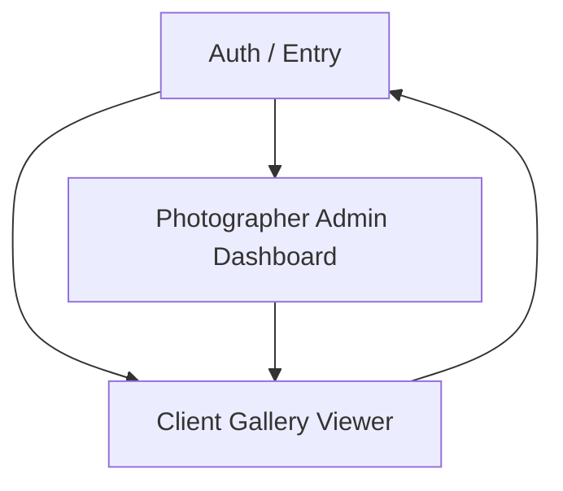

## 1. Product Overview
A Pixieset-style platform for photographers to deliver private client galleries.
Clients can proof (favorites/ratings/limits), comment, pay to unlock downloads, and receive email notifications.

## 2. Core Features

### 2.1 User Roles
| Role | Registration Method | Core Permissions |
|------|---------------------|------------------|
| Photographer (Admin) | Email + password | Create/manage galleries, upload assets, set proofing rules, publish to clients, review feedback, manage payments, unlock downloads. |
| Client | Email magic link (no password) | View invited galleries, proof (favorite/rate within limits), comment, pay to unlock downloads, download purchased/unlocked assets. |

### 2.2 Feature Module
Our product requirements consist of the following main pages:
1. **Auth / Entry**: photographer sign up/login; client magic-link login entry.
2. **Photographer Admin Dashboard**: gallery management, uploads + thumbnails, proofing settings, client invites, activity, payment configuration.
3. **Client Gallery Viewer**: secure gallery viewing, proofing (favorites/ratings/limits), comments, paywall + purchase, downloads after unlock.

### 2.3 Page Details
| Page Name | Module Name | Feature description |
|-----------|-------------|---------------------|
| Auth / Entry | Photographer authentication | Sign up, sign in, sign out; reset password. |
| Auth / Entry | Client magic link access | Request magic link by email; complete login; handle expired/invalid link state. |
| Photographer Admin Dashboard | Gallery list + status | Create, rename, archive; show status (draft/published), client count, last activity. |
| Photographer Admin Dashboard | Uploads + thumbnails | Upload photos to cloud storage; generate/store thumbnails; show upload progress; reorder; delete. |
| Photographer Admin Dashboard | Proofing settings | Configure per-gallery: enable favorites, enable ratings (e.g., 1–5), set selection limit (max favorites), set rating required/optional. |
| Photographer Admin Dashboard | Client invites + access control | Add client emails; send invite email; revoke access; view who has accessed. |
| Photographer Admin Dashboard | Feedback review | View favorites/ratings summary per image; export list (CSV) of client selections. |
| Photographer Admin Dashboard | Payments + downloads policy | Set “downloads locked until paid”; set price/package notes; view payment/unlock status. |
| Client Gallery Viewer | Gallery access + viewing | Display invited galleries; open gallery; view grid + lightbox; load thumbnails first then full image. |
| Client Gallery Viewer | Proofing (favorites/ratings/limits) | Favorite/unfavorite with limit enforcement; rate images; show remaining selections; prevent exceeding limit with clear messaging. |
| Client Gallery Viewer | Comments | Add comments per image; show thread; notify photographer on new comment. |
| Client Gallery Viewer | Pay-to-unlock downloads | Show locked state; start checkout; on success, unlock downloads for entitled assets. |
| Client Gallery Viewer | Downloads | Download individual assets; optionally download selected (favorites) as a zip when unlocked. |

## 3. Core Process
**Photographer flow**: You sign up/login → create a gallery → upload images (thumbnails generated) → configure proofing rules and download lock → add client emails → publish/send invites → monitor comments + proofing results → after client pays, downloads are unlocked.

**Client flow**: You open email magic link → view your invited gallery → proof by selecting favorites/ratings (within limits) → comment as needed → complete payment to unlock downloads → download unlocked images.

