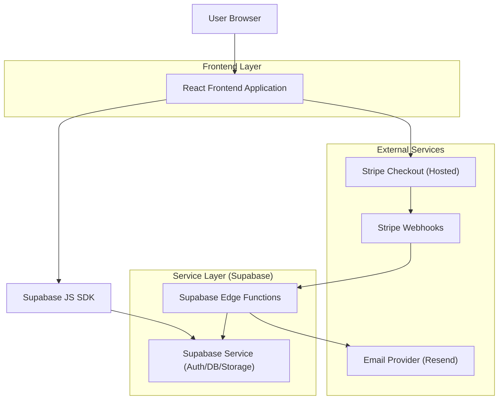
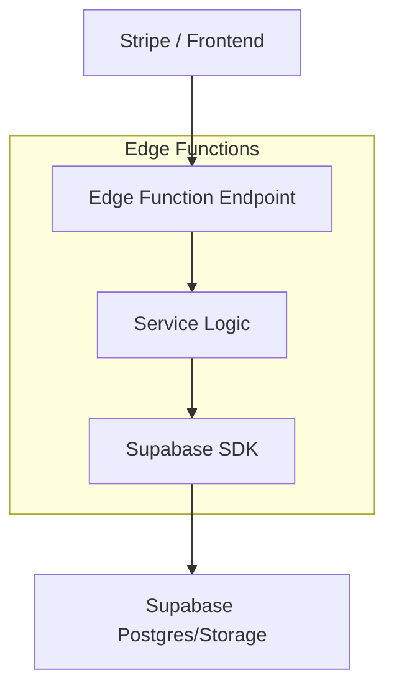
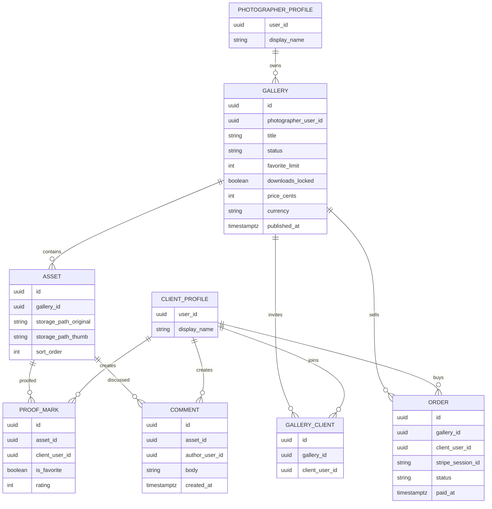

## 1.Architecture design


## 2.Technology Description
- Frontend: React@18 + vite + tailwindcss@3
- Backend: Supabase (Auth + Postgres + Storage + Edge Functions)
- Payments: Stripe Checkout + Webhooks
- Email: Resend (called from Edge Functions)

## 3.Route definitions
| Route | Purpose |
|-------|---------|
| / | Entry page: product intro + photographer login/signup + client magic-link login |
| /admin | Photographer dashboard: galleries, uploads, proofing rules, invites, results, payments |
| /g/:galleryId | Client gallery viewer: proofing, comments, checkout, downloads |

## 4.API definitions (If it includes backend services)
### 4.1 Core API
1) Create Stripe checkout session
```
POST /functions/v1/stripe-create-checkout
```
Request (TypeScript)
```ts
type CreateCheckoutReq = {
  galleryId: string;
  priceCents: number;
  currency: "usd" | "eur" | string;
  successUrl: string;
  cancelUrl: string;
};
```
Response
```ts
type CreateCheckoutRes = { url: string };
```

2) Stripe webhook (server-to-server)
```
POST /functions/v1/stripe-webhook
```
- Verifies Stripe signature
- Marks order paid
- Creates download entitlement for the client + gallery

3) Send notification email (internal)
```
POST /functions/v1/notify
```
```ts
type NotifyReq = {
  template: "gallery_invite" | "new_comment";
  toEmail: string;
  payload: Record<string, string>;
};
```

## 5.Server architecture diagram (If it includes backend services)


## 6.Data model(if applicable)
### 6.1 Data model definition


### 6.2 Data Definition Language
```sql
CREATE TABLE photographer_profiles (
  user_id UUID PRIMARY KEY,
  display_name TEXT
);

CREATE TABLE client_profiles (
  user_id UUID PRIMARY KEY,
  display_name TEXT
);

CREATE TABLE galleries (
  id UUID PRIMARY KEY DEFAULT gen_random_uuid(),
  photographer_user_id UUID NOT NULL,
  title TEXT NOT NULL,
  status TEXT NOT NULL DEFAULT 'draft',
  favorite_limit INT DEFAULT 0,
  downloads_locked BOOLEAN NOT NULL DEFAULT true,
  price_cents INT NOT NULL DEFAULT 0,
  currency TEXT NOT NULL DEFAULT 'usd',
  published_at TIMESTAMPTZ,
  created_at TIMESTAMPTZ NOT NULL DEFAULT now()
);

CREATE TABLE assets (
  id UUID PRIMARY KEY DEFAULT gen_random_uuid(),
  gallery_id UUID NOT NULL,
  storage_path_original TEXT NOT NULL,
  storage_path_thumb TEXT NOT NULL,
  sort_order INT NOT NULL DEFAULT 0
);

CREATE TABLE gallery_clients (
  id UUID PRIMARY KEY DEFAULT gen_random_uuid(),
  gallery_id UUID NOT NULL,
  client_user_id UUID NOT NULL
);

CREATE TABLE proof_marks (
  id UUID PRIMARY KEY DEFAULT gen_random_uuid(),
  asset_id UUID NOT NULL,
  client_user_id UUID NOT NULL,
  is_favorite BOOLEAN NOT NULL DEFAULT false,
  rating INT
);

CREATE TABLE comments (
  id UUID PRIMARY KEY DEFAULT gen_random_uuid(),
  asset_id UUID NOT NULL,
  author_user_id UUID NOT NULL,
  body TEXT NOT NULL,
  created_at TIMESTAMPTZ NOT NULL DEFAULT now()
);

CREATE TABLE orders (
  id UUID PRIMARY KEY DEFAULT gen_random_uuid(),
  gallery_id UUID NOT NULL,
  client_user_id UUID NOT NULL,
  stripe_session_id TEXT NOT NULL,
  status TEXT NOT NULL DEFAULT 'created',
  paid_at TIMESTAMPTZ
);

-- Permissions baseline (fine-tune with RLS policies)
GRANT SELECT ON galleries, assets TO anon;
GRANT ALL PRIVILEGES ON galleries, assets, gallery_clients, proof_marks, comments, orders TO authenticated;
```
